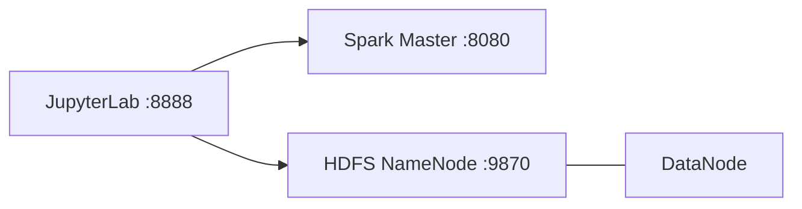

# qnap-jupyter-helper-notes

<p align="center">
  
</p>

<p align="center">
  
  
  
  
  
  
  
</p>

---

## What's inside

| File | What it is |
|------|------------|
| [`docker-compose.qnap.yml`](docker-compose.qnap.yml) | Multi-service QNAP Container Station sample (Portainer, Gitea, Drone, Pi-hole, …) |
| [`docker-compose.jupyter.yml`](docker-compose.jupyter.yml) | Jupyter + Spark + Hadoop lab stack |
| [`jupyter.md`](jupyter.md) | Step-by-step guide for the Jupyter stack |
| [`Python_Package.md`](Python_Package.md) | Python packages by category (install + upgrade) |
| [`LICENSE`](LICENSE) | MIT |

---

## Quick start

**QNAP / Container Station**

1. Open Portainer or Container Station → Create Application  
2. Paste / upload [`docker-compose.qnap.yml`](docker-compose.qnap.yml)  
3. Prefer named volumes created in Portainer for reuse

**Jupyter lab (local)**

```bash
docker compose -f docker-compose.jupyter.yml up --build
```

| Service | URL |
|---------|-----|
| JupyterLab | http://localhost:8888 |
| Spark Master UI | http://localhost:8080 |
| HDFS NameNode UI | http://localhost:9870 |

Full walkthrough → [`jupyter.md`](jupyter.md)

---

## QNAP compose

Sample stack for **QNAP Container Station** — deploy several containers in one shot.

- Deploy via **Portainer**, or Container Station → **Create** → **Create Application**
- Create **named volumes** in Portainer when you can — easier to reuse and back up

---

## Jupyter + Spark + Hadoop

Lightweight big-data lab in Docker:



- **Hadoop HDFS** — NameNode + DataNode  
- **Apache Spark** — master (standalone)  
- **Jupyter** — PySpark-ready notebook

### Persist notebooks

Mount a host folder into the Jupyter container:

```yaml
volumes:
  # Windows
  - "/c/Users/yourusername/notebooks:/home/jovyan/work"
  # macOS / Linux
  # - "./notebooks:/home/jovyan/work"
```

Swap the left side for your real path.

---

## License

MIT — see [LICENSE](LICENSE).
